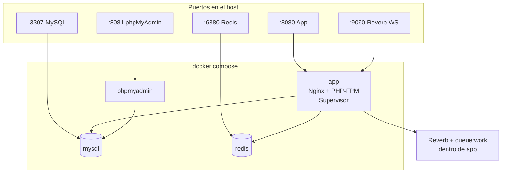
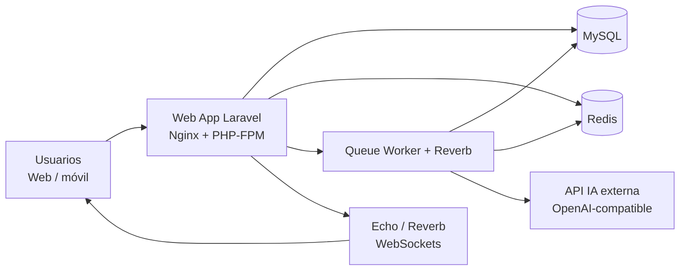
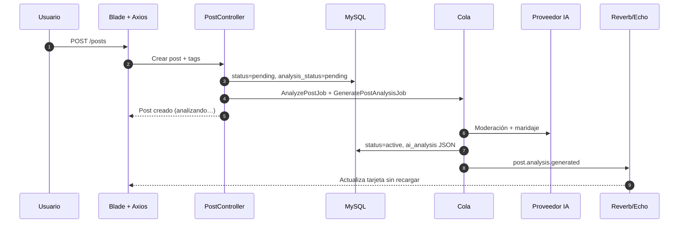
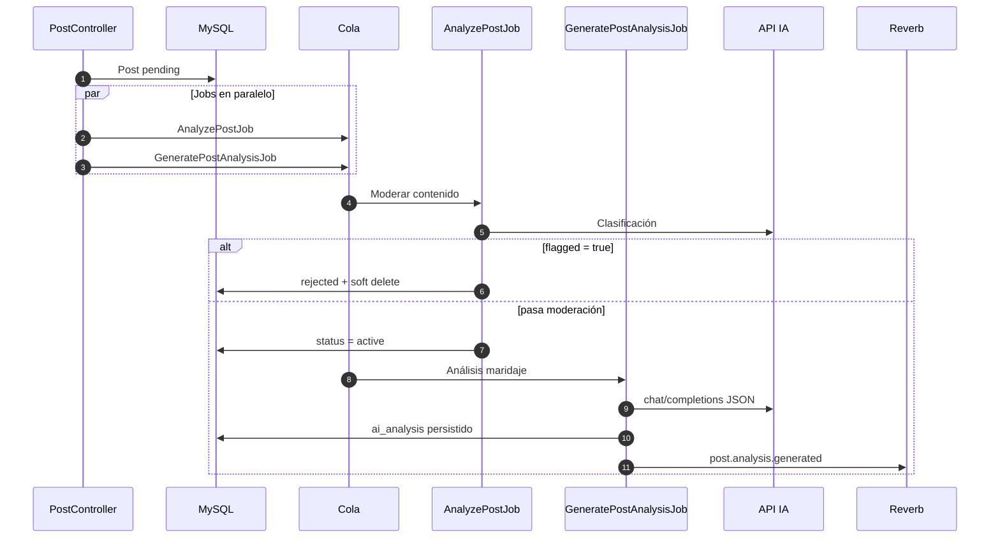
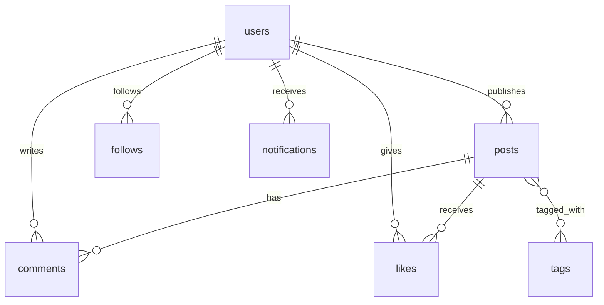
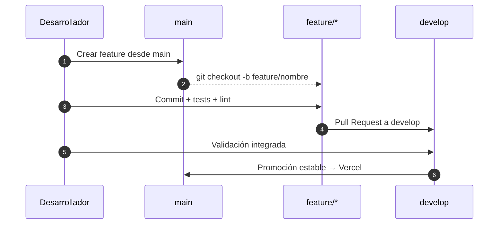
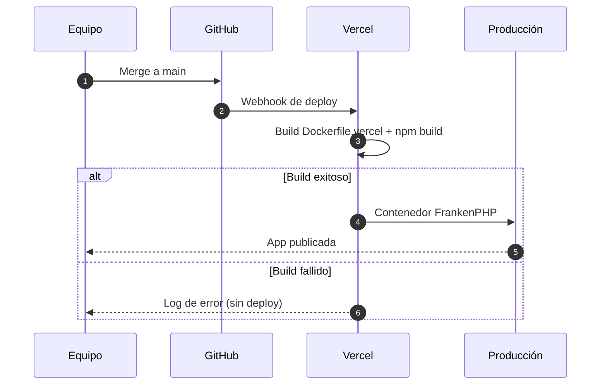
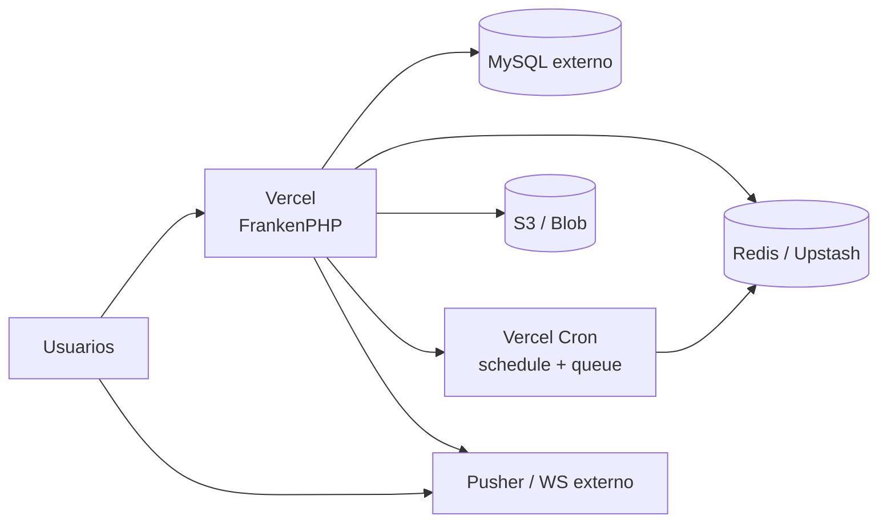

# Entre Sabores

Red social gastronómica orientada al **intercambio cultural**: publicaciones de maridaje, muro con exploración, interacciones sociales y **análisis de maridaje asistido por IA**.


> [!NOTE]
> Monolito Laravel con colas para IA, broadcasting WebSocket (Reverb) y frontend Blade + JavaScript modular compatible con CSP estricta.

---

## Visión general

Entre Sabores centraliza:

- publicación y descubrimiento de maridajes con etiquetas de catálogo,
- muro con modos **FYP / Siguiendo** y orden **Recientes / Populares / Tendencia**,
- interacción social (likes, comentarios en hilos, seguimiento, notificaciones),
- perfiles públicos y registro guiado en 4 pasos,
- moderación automática y análisis de maridaje en segundo plano.

> [!TIP]
> Si llegas nuevo al proyecto, empieza por `app/Services/WallFeedService.php`, `routes/web.php` y `resources/js/wall.js`.

## Quick Start (60 segundos)

```bash
cp .env.example .env
docker compose up -d --build
docker compose exec app php artisan key:generate
docker compose exec app php artisan migrate --seed
```

> [!TIP]
> Luego abre `http://localhost:8080` y ejecuta `docker compose exec app php artisan test --compact` para validar el entorno.

---

## Documentación del proyecto

| Área | Ubicación |
|------|-----------|
| **Guía técnica integral** | [`DOCUMENTACION.md`](DOCUMENTACION.md) |
| Arquitectura y feed del muro | [`ARCHITECTURE.md`](ARCHITECTURE.md) |
| Backend (requests, jobs, policies) | [`BACKEND.md`](BACKEND.md) |
| Frontend (Vite, Echo, módulos UI) | [`FRONTEND.md`](FRONTEND.md) |
| Base de datos y migraciones | [`DATABASE.md`](DATABASE.md) |
| Docker / desarrollo local | [`DOCKER.md`](DOCKER.md) |
| Producción y checklist | [`PRODUCTION.md`](PRODUCTION.md) |
| Seguridad y CSP | [`SECURITY.md`](SECURITY.md) |
| Rendimiento del feed | [`PERFORMANCE.md`](PERFORMANCE.md) |
| Despliegue Vercel | [`VERCEL.md`](VERCEL.md) |
| Flujo Git del equipo | [`GIT-WORKFLOW.md`](GIT-WORKFLOW.md) |
| Changelog | [`CHANGELOG.md`](CHANGELOG.md) |
| Variables de producción | [`.env.production.example`](.env.production.example) |

---

## Índice

- [Entre Sabores](#entre-sabores)
  - [Visión general](#visión-general)
  - [Quick Start (60 segundos)](#quick-start-60-segundos)
  - [Documentación del proyecto](#documentación-del-proyecto)
  - [Índice](#índice)
  - [Stack tecnológico](#stack-tecnológico)
    - [Backend](#backend)
    - [Frontend](#frontend)
    - [Infraestructura (Docker)](#infraestructura-docker)
  - [Requisitos](#requisitos)
  - [Puesta en marcha (Docker)](#puesta-en-marcha-docker)
    - [1) Clonar y entrar al proyecto](#1-clonar-y-entrar-al-proyecto)
    - [2) Crear variables de entorno](#2-crear-variables-de-entorno)
    - [3) Construir y levantar contenedores](#3-construir-y-levantar-contenedores)
    - [4) Instalar dependencias y preparar app](#4-instalar-dependencias-y-preparar-app)
    - [5) Accesos locales](#5-accesos-locales)
  - [Puesta en marcha (sin Docker)](#puesta-en-marcha-sin-docker)
  - [Servicios Docker](#servicios-docker)
    - [Diagrama de servicios (desarrollo local)](#diagrama-de-servicios-desarrollo-local)
  - [Comandos útiles](#comandos-útiles)
    - [Desarrollo](#desarrollo)
    - [Pruebas](#pruebas)
    - [Lint y formateo (scripts Composer)](#lint-y-formateo-scripts-composer)
  - [Arquitectura de alto nivel](#arquitectura-de-alto-nivel)
    - [Vista de contenedores (alto nivel)](#vista-de-contenedores-alto-nivel)
    - [Secuencia de caso clave: crear publicación con IA](#secuencia-de-caso-clave-crear-publicación-con-ia)
  - [Flujo funcional del muro](#flujo-funcional-del-muro)
    - [Diagrama de decisión del feed](#diagrama-de-decisión-del-feed)
  - [Flujo de moderación y maridaje (IA)](#flujo-de-moderación-y-maridaje-ia)
  - [Base de datos](#base-de-datos)
    - [Relación principal de datos (ER simplificado)](#relación-principal-de-datos-er-simplificado)
  - [Estructura del proyecto](#estructura-del-proyecto)
  - [Seguridad y autorización](#seguridad-y-autorización)
  - [Solución de problemas](#solución-de-problemas)
  - [FAQ de onboarding](#faq-de-onboarding)
  - [Runbook operativo](#runbook-operativo)
  - [Contribución](#contribución)
  - [GitFlow del proyecto](#gitflow-del-proyecto)
  - [CI/CD y despliegue](#cicd-y-despliegue)
  - [Arquitectura en la nube (producción)](#arquitectura-en-la-nube-producción)
  - [Ambientes](#ambientes)
  - [Variables de entorno críticas](#variables-de-entorno-críticas)
  - [Observabilidad y monitoreo](#observabilidad-y-monitoreo)
  - [Seguridad y secretos](#seguridad-y-secretos)
  - [Estado del proyecto](#estado-del-proyecto)

---

## Stack tecnológico

### Backend

- **PHP 8.4**
- **Laravel 13**
- **Laravel Breeze** (auth y scaffolding)
- **Laravel Reverb** (broadcasting WebSocket)
- **Intervention Image** (procesamiento de imágenes)
- Colas: `database` (local mínimo) o **Redis** (Docker/producción)

### Frontend

- **Blade** + **Tailwind CSS 3**
- **Vite 8** + **Axios**
- **JavaScript modular** (`resources/js/ui/`, sin Alpine.js; CSP-friendly)
- **Flowbite 4**, **Plus Jakarta Sans**, **CropperJS**
- **Laravel Echo + Pusher JS** (cliente WebSocket)

### Infraestructura (Docker)

- **Nginx + PHP-FPM** (contenedor `app`, Supervisor)
- **MySQL 8** (contenedor `db`)
- **Redis 7** (caché/colas)
- **phpMyAdmin** (administración BD)
- **Reverb + queue worker** dentro de `app` (Supervisor)

---

## Requisitos

- Docker y Docker Compose v2 (recomendado)

> [!WARNING]
> El stack local expone puertos fijos (`8080`, `8081`, `3307`, `6380`, `9090`). Verifica que no estén ocupados antes de iniciar.

Alternativa sin Docker: PHP 8.4, Composer, Node.js/npm y MySQL.

---

## Puesta en marcha (Docker)

### 1) Clonar y entrar al proyecto

```bash
git clone <repo-url>
cd Entre-Sabores
```

### 2) Crear variables de entorno

```bash
cp .env.example .env
```

> [!IMPORTANT]
> Para Docker, los servicios internos usan hostnames `mysql`, `redis`. El compose fuerza `DB_CONNECTION=mysql` en el contenedor `app`.

### 3) Construir y levantar contenedores

```bash
docker compose up -d --build
```

### 4) Instalar dependencias y preparar app

```bash
docker compose exec app php artisan key:generate
docker compose exec app php artisan migrate --seed
```

Si falta el build de Vite (`public/build/manifest.json`), el arranque puede compilar assets automáticamente; forzar con `DOCKER_ALWAYS_BUILD_ASSETS=1` en `.env`.

### 5) Accesos locales

- App: `http://localhost:8080`
- phpMyAdmin: `http://localhost:8081`
- MySQL (desde el host): `127.0.0.1:3307`
- Redis (desde el host): `127.0.0.1:6380`
- Reverb (WebSockets): `localhost:9090`

> [!TIP]
> Detalle de rendimiento en Windows/WSL y variables `DOCKER_*`: [`DOCKER.md`](DOCKER.md).

---

## Puesta en marcha (sin Docker)

```bash
cp .env.example .env
composer install
php artisan key:generate
php artisan migrate
npm install
npm run build
php artisan serve
```

Para colas y tiempo real en paralelo:

```bash
composer run dev
```

Levanta servidor HTTP, cola, logs (`pail`), Vite y Reverb. Atajo de instalación: `composer setup`.

---

## Servicios Docker

Componentes levantados por `docker compose`:

- `app`: runtime web Laravel (PHP-FPM + Nginx + Supervisor), expuesto en `:8080`. Supervisor gestiona Reverb y `queue:work`.
- `mysql`: MySQL 8, expone `:3307` en el host.
- `phpmyadmin`: consola BD, expone `:8081`.
- `redis`: caché/colas, expone `:6380` en el host.

### Diagrama de servicios (desarrollo local)



> [!NOTE]
> En Docker la app resuelve servicios por hostname interno: `mysql`, `redis`.

---

## Comandos útiles

### Desarrollo

```bash
docker compose exec app php artisan route:list
docker compose exec app php artisan optimize:clear
docker compose exec app php artisan queue:work
docker compose exec app php artisan reverb:start
```

### Pruebas

```bash
docker compose exec app php artisan test --compact
composer test
```

### Lint y formateo (scripts Composer)

```bash
composer lint      # pint --test
composer format    # pint
```

> [!TIP]
> Flujo recomendado antes de PR: `composer lint` + `php artisan test --compact`.

---

## Arquitectura de alto nivel

Entre Sabores opera como monolito Laravel: HTTP síncrono para la UI, colas para IA/moderación y WebSockets para notificaciones y análisis listo.

### Vista de contenedores (alto nivel)



### Secuencia de caso clave: crear publicación con IA



---

## Flujo funcional del muro

Resumen del feed (`WallFeedService`):

1. Usuario elige **FYP** o **Siguiendo** (`following=1`).
2. Usuario elige chip **Recientes / Populares / Tendencia** (`sort`).
3. Cliente (`wall.js`) consulta `GET /posts/filter` con paginación.
4. Backend aplica ramas: siguiendo → mixto 70/30 (si aplica) → exploración global.
5. Respuesta JSON vía `PostResource`; scroll infinito mantiene los mismos parámetros.

| En la UI | Parámetro HTTP | Comportamiento (resumen) |
|----------|----------------|--------------------------|
| **FYP** / **Siguiendo** | `following` ausente vs `following=1` | Exploración global vs solo seguidos |
| **Recientes** / **Populares** / **Tendencia** | `sort=recent` \| `popular` \| `trending` | Orden temporal, engagement + maridaje, o trending 30 días |

### Diagrama de decisión del feed

```mermaid
flowchart TD
    START[GET /posts/filter] --> F{following=1?}
    F -->|Sí| AUTH{Usuario autenticado?}
    AUTH -->|No| EMPTY[Feed vacío + meta login]
    AUTH -->|Sí| FOLLOW[followingFeed\nposts de seguidos]
    F -->|No| SORT{sort = recent\ny autenticado?}
    SORT -->|Sí| MIXED{Tiene seguidos?}
    MIXED -->|Sí| MIX[mixedOrGlobalRecent\n70% seguidos + 30% global]
    MIXED -->|No| GLOBAL1[globalExploreFeed\nrecientes globales]
    SORT -->|No| GLOBAL2[globalExploreFeed\npopular / trending / invitado]
    FOLLOW --> SORT2[applySort\nrecent | popular | trending]
    MIX --> OUT[PostResource JSON + meta.feed_mode]
    GLOBAL1 --> OUT
    GLOBAL2 --> OUT
    SORT2 --> OUT
    EMPTY --> OUT
```

> [!IMPORTANT]
> Detalle completo del feed, ranking y limitaciones de paginación: [`ARCHITECTURE.md`](ARCHITECTURE.md#feed-del-muro-wallfeedservice).

---

## Flujo de moderación y maridaje (IA)

1. Crear/editar post → `status=pending`, `analysis_status=pending`.
2. Se encolan `AnalyzePostJob` (moderación) y `GeneratePostAnalysisJob` (maridaje).
3. Si moderación `flagged=true` → `rejected`, soft delete, notificación al autor.
4. Si pasa → `status=active`, `analysis_status=completed`, `ai_analysis` persistido.
5. Frontend muestra «Analizando contenido…» y actualiza por WebSocket.
6. El autor puede `POST /posts/{post}/reanalyze` para regenerar análisis.



> [!NOTE]
> La IA es opcional: sin claves de API configuradas, el sistema degrada con fallbacks documentados en [`DOCUMENTACION.md`](DOCUMENTACION.md).

---

## Base de datos

Motor principal: **MySQL 8** (SQLite en memoria para tests).

Entidades centrales:

- `users` — identidad, perfil, país, preferencias.
- `posts` — maridajes; estados de moderación; `ai_analysis` JSON; soft deletes.
- `tags` / `post_tag` — catálogo (país, comida, bebida, experiencia) y pivote N:M.
- `comments` — hilos con `parent_id`.
- `likes`, `follows` — interacción y grafo social.
- `notifications` — alertas in-app.

### Relación principal de datos (ER simplificado)



> [!WARNING]
> La migración grande de posts/tags puede impedir rollback limpio. Haz backup antes de desplegar en entornos nuevos.

---

## Estructura del proyecto

```text
app/
  Http/Controllers/       # Controladores delgados
  Http/Requests/          # Validación de entrada
  Services/               # WallFeedService, MaridajeAiAnalysisService, AIService…
  Jobs/                   # AnalyzePostJob, GeneratePostAnalysisJob
  Models/                 # Post, User, Tag, Comment…
  Policies/               # Autorización por recurso
  Support/                # CommunityStats, RegisterCountryDetector…
resources/
  views/                  # Blade (muro, perfil, auth, componentes)
  js/                     # wall.js, ui/, social/, echo.js
  css/app.css             # Design system (tokens CSS)
routes/
  web.php                 # Rutas HTTP principales
  auth.php                # Breeze
database/
  migrations/
  seeders/
tests/
  Feature/
docker-compose.yml
Dockerfile.vercel         # Imagen FrankenPHP para Vercel
```

---

## Seguridad y autorización

- Autenticación con **Laravel Breeze** (sesión + CSRF).
- Autorización con **Policies** (`PostPolicy`, etc.) en acciones sensibles.
- **Rate limiting** por dominio: feed, tags, comentarios, likes, notificaciones, auth, creación de posts, follows, reanalizar.
- Cabeceras de seguridad y **CSP** en producción (`SecurityHeaders`, `config/security.php`).

> [!WARNING]
> No confíes solo en la UI para ocultar acciones: valida siempre en backend con policies y Form Requests.

Detalle: [`SECURITY.md`](SECURITY.md).

---

## Solución de problemas

> [!WARNING]
> Si algo «no refleja cambios», suele ser caché Laravel o assets sin build.

| Problema | Solución rápida |
|----------|-----------------|
| Error 500 en Blade | `php artisan optimize:clear` y `php artisan view:clear` |
| Cambios frontend no visibles | `npm run build` (o `npm run dev`) |
| WebSockets no conectan | Verificar Reverb en `:9090`, variables `REVERB_*` y `VITE_REVERB_*` |
| Cola no procesa jobs | Confirmar `queue:work` o worker en Supervisor |
| BD no conecta en Docker | `docker compose ps`; credenciales alineadas con servicio `mysql` |
| Feed vacío en «Siguiendo» | Requiere sesión y usuarios seguidos |

Más contexto Docker/WSL: [`DOCKER.md`](DOCKER.md).

---

## FAQ de onboarding

### 1) ¿Por dónde empiezo a leer código?

`WallFeedService`, `PostController`, `resources/js/wall.js` y `PostResource`.

### 2) ¿Cómo levanto todo sin instalar PHP local?

Con Docker: `docker compose up -d --build` y comandos con `docker compose exec app …`.

### 3) ¿Por qué no veo cambios en frontend?

Ejecuta `npm run build` o usa `composer run dev` / `npm run dev`.

### 4) ¿Dónde está la lógica de IA?

`app/Services/MaridajeAiAnalysisService.php`, `app/Services/AIService.php` y jobs en `app/Jobs/`.

### 5) ¿Qué validaciones mínimas debo correr antes de PR?

`composer lint` + `php artisan test --compact`.

### 6) ¿Cómo funciona el despliegue a producción?

Solo la rama **`main`** despliega en Vercel. Ver [`VERCEL.md`](VERCEL.md) y [`GIT-WORKFLOW.md`](GIT-WORKFLOW.md).

---

## Runbook operativo

### Verificación rápida de salud

1. `GET /health` — DB, cache, cola (token opcional).
2. `GET /internal/metrics` — métricas operativas (protegido).
3. Revisar logs (`storage/logs`) y estado de colas.
4. Confirmar conectividad MySQL, Redis y proveedor IA.

### Incidente: la app responde 500

1. Revisar logs de Laravel.
2. `php artisan optimize:clear`
3. Verificar migraciones pendientes y variables de entorno.

### Incidente: colas detenidas o atrasadas

1. Confirmar worker (`queue:work` o Supervisor).
2. En Vercel: revisar cron `/internal/cron/queue` — [`VERCEL.md`](VERCEL.md).
3. Validar conexión Redis y jobs fallidos.

### Checklist post-despliegue

- Smoke test: login, muro, crear post, notificación.
- Jobs de IA y moderación procesándose.
- WebSockets operativos (Reverb o Pusher según entorno).
- `/health` en verde.

Detalle ampliado: [`PRODUCTION.md`](PRODUCTION.md).

---

## Contribución

Flujo sugerido:

1. Crear rama `feature/*` **desde `main`**.
2. Implementar cambios siguiendo convenciones del repo.
3. Ejecutar `composer lint` + `php artisan test --compact`.
4. Abrir PR con resumen funcional y plan de pruebas.

> [!TIP]
> Prioriza cambios pequeños, enfocados y con pruebas relacionadas al comportamiento modificado.

Convención de ramas: `feature/nombre-corto`, `hotfix/descripcion`.

---

## GitFlow del proyecto

| Rama | Rol |
|------|-----|
| `main` | Estable; despliega en Vercel |
| `develop` | Integración de features |
| `feature/*` | Una tarea; **creada desde `main`** |

```text
main ──► feature/mi-tarea ──(PR)──► develop ──(PR)──► main
```

### Secuencia de ramas (GitFlow aplicado)



> [!IMPORTANT]
> Las features nacen desde `main`, pero la integración previa a producción ocurre en `develop`.

Detalle: [`GIT-WORKFLOW.md`](GIT-WORKFLOW.md).

---

## CI/CD y despliegue

Flujo productivo:

1. PR y merge según GitFlow (`feature/*` → `develop` → `main`).
2. Push a **`main`** dispara build en **Vercel** (contenedor FrankenPHP).
3. Servicios externos: MySQL, Redis (Upstash), almacenamiento S3/Blob.
4. Cron Vercel para scheduler y colas (`/internal/cron/*`).

> [!WARNING]
> No promover a `main` si los tests locales o de revisión fallan.

### Secuencia de despliegue (Git → Vercel → Prod)



Detalle: [`VERCEL.md`](VERCEL.md).

---

## Arquitectura en la nube (producción)

En producción (Vercel), la aplicación HTTP corre en contenedor **FrankenPHP**; persistencia y tiempo real se externalizan:

- **App Entre Sabores**: HTTP Laravel (Fluid compute).
- **MySQL**: servicio gestionado externo.
- **Redis**: Upstash u otro (cache, colas, métricas).
- **Almacenamiento**: S3 / Vercel Blob para imágenes.
- **WebSockets**: Pusher Cloud o Reverb externo (Reverb no corre dentro del contenedor Vercel).



---

## Ambientes

| Ambiente | Propósito | Rama de referencia | Despliegue |
|----------|-----------|-------------------|------------|
| `local` | Desarrollo del equipo | `feature/*` | Docker local o `composer run dev` |
| `develop` | Integración y validación | `develop` | Sin deploy automático en Vercel |
| `production` | Usuarios finales | `main` | Vercel (solo `main`) |

---

## Variables de entorno críticas

| Variable | Uso | Ejemplo (Docker local) |
|----------|-----|------------------------|
| `APP_ENV` | Contexto de ejecución | `local` |
| `APP_DEBUG` | Depuración | `true` |
| `APP_URL` | URL base | `http://localhost:8080` |
| `APP_LOCALE` | Idioma | `es` |
| `DB_HOST` | Host MySQL | `mysql` (Docker) / `127.0.0.1` |
| `DB_DATABASE` | Nombre BD | `entre_sabores` |
| `QUEUE_CONNECTION` | Backend de colas | `database` o `redis` |
| `REDIS_HOST` | Host Redis | `redis` |
| `BROADCAST_CONNECTION` | Driver broadcasting | `reverb` |
| `REVERB_APP_KEY` | Clave Reverb | ver `.env.example` |
| `VITE_REVERB_*` | Cliente Echo en build | alineadas con Reverb |
| `OPENAI_API_KEY` | IA maridaje/moderación | opcional |
| `OPENAI_BASE_URL` | Endpoint compatible OpenAI | opcional |

> [!WARNING]
> Nunca publiques secretos reales en el repositorio. Usa `.env` local y variables de Vercel para producción.

Referencias: [`.env.example`](.env.example), [`.env.production.example`](.env.production.example), [`.env.vercel.example`](.env.vercel.example).

---

## Observabilidad y monitoreo

Puntos mínimos en QA/producción:

- **Aplicación**: logs JSON (`structured`), eventos `OperationalLogger`.
- **Salud**: `GET /health` (DB, cache, cola).
- **Métricas**: `GET /internal/metrics` (Redis, protegido).
- **Asíncrono**: latencia de colas, jobs fallidos (IA/moderación).
- **Pipeline**: historial de deploys en Vercel.

Comando de mantenimiento: `php artisan notifications:prune` (notificaciones leídas antiguas).

Detalle: [`PRODUCTION.md`](PRODUCTION.md), [`ARCHITECTURE.md`](ARCHITECTURE.md).

---

## Seguridad y secretos

- Secretos en `.env` local y **variables de entorno de Vercel** (producción).
- Prohibido commitear credenciales reales (`.env`, claves IA, BD).
- Rotar claves ante sospecha de exposición.
- CSP estricta en producción; iconos y fuentes autopublicados (sin CDN externo).

> [!WARNING]
> Ante exposición de credenciales: revocar, rotar, redeploy y documentar incidente.

Detalle: [`SECURITY.md`](SECURITY.md).

---

## Estado del proyecto

El proyecto está en **evolución activa** sobre una base estable: feed documentado, IA en colas, tests de características sociales, observabilidad básica y despliegue Vercel operativo.

> [!IMPORTANT]
> Todo cambio debe respetar las convenciones del repositorio y mantener las pruebas relevantes en verde.

---

## Licencia

MIT (plantilla Laravel); el contenido específico del proyecto Entre Sabores pertenece al equipo del proyecto según los acuerdos académicos aplicables.
