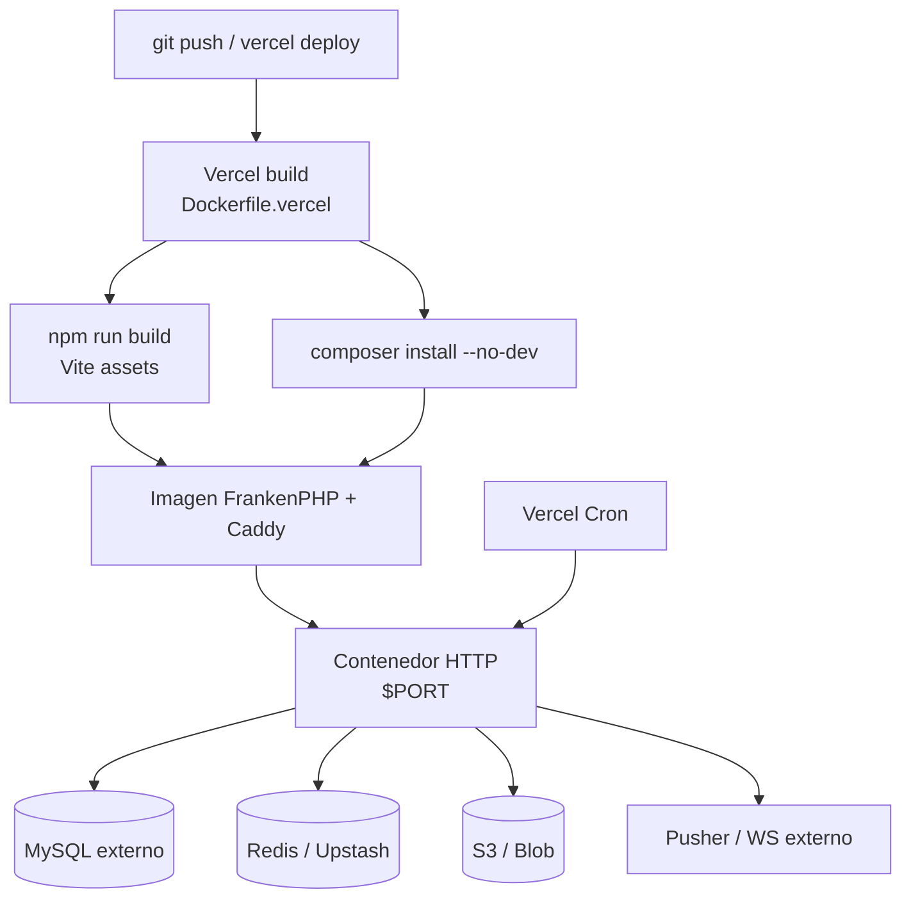

# Despliegue en Vercel (Docker)

> **Stack local completo (MySQL, Redis, Reverb, workers):** [DOCKER.md](DOCKER.md)  
> **Checklist operativo general:** [PRODUCTION.md](PRODUCTION.md)

Entre Sabores se despliega en **Vercel** como **contenedor OCI** (`Dockerfile.vercel` + FrankenPHP). Vercel construye la imagen, la almacena en su Container Registry y la sirve con **Fluid compute** (escala a cero cuando no hay tráfico).

**Última revisión:** 2026-08-28.

## Arquitectura



### Qué va dentro del contenedor

| Componente | En Vercel |
|------------|-----------|
| HTTP (Nginx/FrankenPHP) | Sí |
| PHP-FPM / FrankenPHP | Sí |
| Assets Vite (`public/build`) | Sí (build en imagen) |
| MySQL | **No** — servicio externo |
| Redis | **No** — Upstash u otro |
| Reverb (WebSockets) | **No** — usar Pusher Cloud o WS externo |
| `queue:work` persistente | **No** — cron externo o plan Pro (ver abajo) |
| `schedule:run` (cron) | Vercel Cron diario → `/internal/cron/schedule` (plan Hobby) |

## Archivos clave

| Archivo | Rol |
|---------|-----|
| `Dockerfile.vercel` | Imagen de producción para Vercel |
| `docker/vercel/Caddyfile` | Servidor HTTP en `$PORT` |
| `docker/vercel/entrypoint.sh` | Caches Laravel y migraciones opcionales |
| `vercel.json` | Servicio container + rewrites + crons |
| `.env.vercel.example` | Variables de referencia |

El `Dockerfile` y `docker-compose.yml` existentes siguen siendo para **desarrollo local**; no los sustituye este flujo.

## Rama de despliegue (solo `main`)

**Política del proyecto:** en Vercel solo se despliega la rama **`main`**. Ni `develop` ni `feature/*` generan build ni URL en Vercel.

| Capa | Configuración |
|------|----------------|
| `vercel.json` | `ignoreCommand` omite el build si la rama no es `main`; `git.deploymentEnabled.develop: false` |
| Vercel Dashboard | **Settings → Git → Production Branch:** `main` |
| Vercel Dashboard | **Settings → Git:** desactivar *Preview Deployments* para otras ramas (recomendado) |
| Flujo Git del repo | Integrar en `develop` vía PR; promover a producción con PR **`develop` → `main`** — el push/merge a `main` dispara el deploy |

Los merges a `develop` **no** deben desplegar en Vercel. Solo cuando el código llega a `main`.

## Requisitos previos

1. Cuenta en [Vercel](https://vercel.com)
2. [Vercel CLI](https://vercel.com/docs/cli): `npm i -g vercel`
3. **MySQL** accesible desde internet (PlanetScale, Railway, Aiven, etc.)
4. **Redis** (recomendado: [Upstash](https://vercel.com/integrations/upstash) desde Vercel Marketplace)
5. **Almacenamiento** para imágenes: S3, R2 o Vercel Blob (`FILESYSTEM_DISK=s3` o adaptador equivalente)
6. **Pusher** (o similar) si necesitas tiempo real — Reverb no corre en contenedores efímeros de Vercel

## Variables de entorno

Copia [.env.vercel.example](.env.vercel.example) como guía. Mínimo en Vercel Dashboard:

| Variable | Notas |
|----------|-------|
| `APP_KEY` | **Obligatoria** — `php artisan key:generate --show` |
| `APP_URL` | URL de producción (`https://entre-sabores.vercel.app`) |
| `TRUSTED_PROXIES` | `*` detrás del proxy de Vercel |
| `DB_*` | MySQL externo |
| `REDIS_URL` o `REDIS_HOST` + credenciales | Solo si `SESSION_DRIVER=redis`; si falta, la app hace fallback a `file` |
| `SESSION_DRIVER` | `file` al inicio; `redis` cuando Upstash esté listo |
| `CACHE_STORE` | `file` al inicio; `redis` en producción madura |
| `QUEUE_CONNECTION` | `sync` al inicio; `redis` + cron externo cuando proceda |
| `CRON_SECRET` | Secreto largo; Vercel lo envía como `Authorization: Bearer` |
| `VITE_*` | Necesarias en **build** para compilar Echo/Pusher |

### Migraciones

- **Manual (recomendado la primera vez):** conecta a la BD y ejecuta `php artisan migrate --force` desde tu máquina o CI.
- **Automático:** `VERCEL_RUN_MIGRATIONS=1` ejecuta migraciones en cada arranque del contenedor (útil en previews; valorar con cuidado en prod).

## Despliegue

### 1. Importar el repositorio

En Vercel Dashboard → **Add New Project** → importa el repo. Vercel debe detectar `Dockerfile.vercel` y `vercel.json` (no el preset Vite).

**Si el build falla con `No Output Directory named "dist"`:** el proyecto se importó como sitio estático Vite. Corrige en **Project Settings → General**:

| Ajuste | Valor |
|--------|-------|
| Framework Preset | **Other** |
| Build Command | vacío / Override desactivado |
| Output Directory | vacío (no `dist`) |
| Install Command | vacío / Override desactivado |

Luego haz **Redeploy** tras subir `vercel.json` y `Dockerfile.vercel` al repositorio.

### 2. Configurar variables

Añade las variables de `.env.vercel.example` en **Production** (rama `main`). Las `VITE_*` deben estar disponibles también en el paso de build.

### 3. CLI (alternativa)

```bash
vercel login
vercel link
vercel env pull .env.vercel.local   # opcional, solo desarrollo
vercel deploy --prod                 # producción (solo si apunta a main)
```

Evita `vercel deploy` sin `--prod` desde ramas que no sean `main`; el proyecto no usa preview deployments en Vercel.

### 4. Probar localmente la imagen

```bash
docker build -f Dockerfile.vercel -t entre-sabores-vercel .
docker run --rm -p 3000:80 \
  -e APP_KEY=base64:... \
  -e APP_ENV=local \
  -e DB_CONNECTION=sqlite \
  entre-sabores-vercel
curl http://localhost:3000/up
```

Con integración Vercel (requiere Docker en el host):

```bash
vercel dev -L
```

## Cron y colas

### Plan Hobby (límite diario)

En **Hobby**, Vercel solo permite crons **una vez al día**. `vercel.json` incluye uno:

| Ruta | Schedule | Acción |
|------|----------|--------|
| `GET /internal/cron/schedule` | `15 3 * * *` (03:15 UTC) | `php artisan schedule:run` |

Coincide con `notifications:prune` en `routes/console.php` (`dailyAt('03:15')`).

**Colas (IA, broadcasts):** no van en `vercel.json` en Hobby. Opciones:

1. **Cron externo** (gratis): [cron-job.org](https://cron-job.org), EasyCron, etc. → `GET https://tu-app.vercel.app/internal/cron/queue` con cabecera `Authorization: Bearer <CRON_SECRET>` cada 1–5 min.
2. **`QUEUE_CONNECTION=sync`** — jobs en la misma petición HTTP (solo demos; IA bloquea la respuesta).
3. **Plan Pro** — añadir en `vercel.json` cron cada minuto para `/internal/cron/queue` (`* * * * *`).

### Plan Pro

Puedes añadir en `vercel.json`:

```json
{
  "path": "/internal/cron/queue",
  "schedule": "* * * * *"
}
```

Y opcionalmente cambiar `schedule` a `* * * * *` para el scheduler Laravel completo.

### Autenticación

Vercel envía `Authorization: Bearer <CRON_SECRET>` en crons nativos. Los cron externos deben enviar la misma cabecera manualmente. El controlador valida contra `config('monitoring.cron_secret')`.

**Limitaciones:**

- Jobs largos (IA de maridaje) pueden superar el tiempo del cron; considera cola `database`/`redis` + varios ticks o un worker externo.
- Los crons de Vercel solo corren en **producción** del proyecto (no en previews).

## Tiempo real (WebSockets)

En Docker local, Reverb corre con Supervisor. En Vercel:

1. `BROADCAST_CONNECTION=pusher`
2. Configura Pusher Cloud (o Soketi en otro host)
3. Alinea `PUSHER_*` y `VITE_PUSHER_*` en build y runtime

Sin Pusher, la app funciona pero sin notificaciones en vivo.

## Salud y métricas

| Endpoint | Uso |
|----------|-----|
| `GET /up` | Probe liviano (Laravel) |
| `GET /health` | Detalle DB/cache/cola; token opcional `HEALTH_CHECK_TOKEN` |
| `GET /internal/metrics` | Métricas; token `METRICS_TOKEN` |

## Troubleshooting

| Síntoma | Causa probable | Solución |
|---------|----------------|----------|
| `No Output Directory named "dist"` | Vercel trata el repo como Vite estático; faltan `vercel.json` / `Dockerfile.vercel` en la rama desplegada | Subir esos archivos; Framework Preset → **Other**; Output Directory vacío |
| Cron `* * * * *` rechazado | Plan Hobby: máx. un cron **diario** | Usar schedule diario en `vercel.json`; cola vía cron externo o Pro |
| `Could not open input file: artisan` en build | `composer install` ejecuta scripts antes de copiar el código | `composer install --no-scripts`; `package:discover` en entrypoint con `APP_KEY` real |
| Build falla en `package:discover` | `APP_KEY` placeholder inválida en imagen | No ejecutar artisan en build; discovery en arranque del contenedor |
| **500** `ArgumentCountError` en `Manager::createDriver()` | `APP_MAINTENANCE_DRIVER` o `BROADCAST_CONNECTION` vacíos en Vercel | Definir `APP_MAINTENANCE_DRIVER=file`; no dejar variables en blanco |
| **500** en `/` | `APP_KEY` vacía, Redis/MySQL mal configurados, o excepción Laravel | Revisar logs; definir `APP_KEY`; usar `SESSION_DRIVER=file` hasta tener Upstash; probar `GET /up` |
| **504** (300 s) | Entrypoint bloqueaba con `config:cache` / `migrate` antes de abrir HTTP | Entrypoint mínimo; no usar `VERCEL_RUN_MIGRATIONS=1` salvo BD lista |
| 502 tras deploy | Servidor no escucha en `$PORT` | Caddyfile usa `:{$PORT:80}` |
| Assets sin estilo | Build sin `VITE_*` | Definir variables en Vercel antes del build |
| Sesión se pierde | `SESSION_DRIVER=file` | Usar `redis` |
| Cola no avanza | Sin cron o `CRON_SECRET` mal | Revisar crons en dashboard y logs |
| Uploads desaparecen | Disco efímero | `FILESYSTEM_DISK=s3` o Blob |
| WS no conecta | Reverb en Vercel | Migrar a Pusher |

## Documentación relacionada

- [DOCKER.md](DOCKER.md) — desarrollo local con Compose
- [PRODUCTION.md](PRODUCTION.md) — checklist general
- [Vercel: PHP con Docker](https://vercel.com/kb/guide/deploy-php-on-vercel-with-docker)
- [Vercel: Container images](https://vercel.com/docs/functions/container-images)
